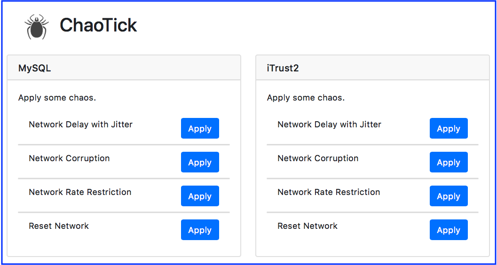

# Project
Spring 2018 CSC 519 Group Project

## Special Milestone

## Screencast

[](https://youtu.be/qiu9llwjjVM)


# Report

For this special milestone, we developed a tool named ChaoTick that assists with Chaos testing our deployments.

##  ChaoTick

ChaoTick provides a web based user interface for applying chaos:



### Experience

ChoaTick takes a list of services that define your application and presents you with various choas testing related options that you can apply to any individual service.

To work better for iTrust2, we switched to running iTrust2 as container services instead of directly on the deployment machine. This gave us more flexibility as we didn't have to worry about taking down an entire machine.

In general, pressing an Apply button in the utility will configure the service's container with the chaos requested.

We implemented ChaoTick in Python, using the flask microframework. While we only implemented an interface to local docker services, we can easily see extending this to deal with services deployed on Docker Swarm or Kubernetes.

### Issues

Sometimes we would apply choas to a service that would kill the service. To combat this we added the ability to restart services to the utility.


### Running ChaoTick

You can deploy ChaoTick alongside your services. For a quick demo, start ChaoTick to manage a local iTrust2 deployment.

```sh-session
$ pipenv install
$ pipenv run flask run
```

The utility will be available at http://localhost:5000.
